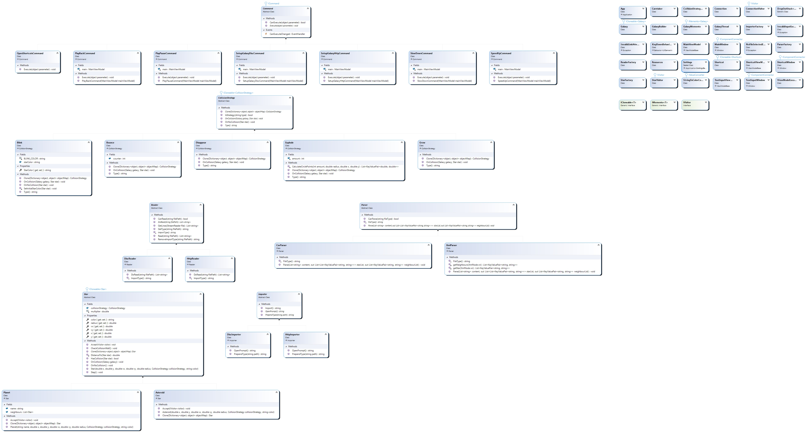

# Flat Galaxy Society

Most of us assume the universe is three-dimensional and planets are spherical.  
But what if the universe were a **two-dimensional plane**, and planets were still round… but also completely flat?

**Flat Galaxy Society** is a C#/.NET project that models this alternative universe.  
It was created as an **Advanced Design Patterns** assignment and demonstrates clean architecture, object-oriented modeling, and test-driven development inside a playful, fictional domain.

[](./ClassDiagram_FlatGalaxySociety.jpg)

---

## Table of Contents

- [Concept](#concept)
- [Features](#features)
- [Architecture & Design](#architecture--design)
- [Project Structure](#project-structure)
- [Getting Started](#getting-started)
- [Running the Application](#running-the-application)
- [Tests](#tests)
- [Documentation](#documentation)
- [Future Improvements](#future-improvements)
- [Author](#author)
- [License](#license)

---

## Concept

**Flat Galaxy Society** models a fictional universe where:

- The galaxy exists on a **two-dimensional plane**.
- Planets are **round but flat**, existing on this plane.
- Relationships between planets, orbits, paths, and “societies” are represented in code.

The purpose of the project is not just functionality, but also to demonstrate:

- Proper use of **design patterns**,  
- **Clean architecture**,  
- Well-structured **object-oriented code**,  
- And **unit testing** to validate domain behavior.

---

## Features

- **2D Universe Model**  
  A full conceptual model of a flat galaxy and its planets.

- **Planets, Orbits & Societies**  
  Classes model planetary bodies, their properties, and groups that inhabit the galaxy.

- **Advanced Design Patterns**  
  Implementations throughout the codebase for flexibility and maintainability.

- **Unit Tests Included**  
  A dedicated project (`FlatGalaxySociety.Tests`) verifies core logic and expected behaviors.

- **Documentation Assets**  
  - Class diagram (`ClassDiagram_FlatGalaxySociety.jpg`)
  - Visual Studio .cd diagram  
  - Rubric / evaluation PDF

---

## Architecture & Design

The project focuses on **clean OOP design and advanced patterns**. Key principles:

- **Separation of Concerns**  
  Logic is structured into clear, focused components.

- **Encapsulation & Polymorphism**  
  Planetary and society behavior is modeled through interfaces and class hierarchies.

- **Composition Over Inheritance**  
  Applied where appropriate to keep the system extensible.

- **Domain-Driven Modeling**  
  Entities represent real domain concepts with clear responsibilities.

Use the included diagrams to explore class relationships:

- `ClassDiagram_FlatGalaxySociety.jpg`
- `FlatGalaxySociety/ClassDiagram_FlatGalaxySociety.cd`

---

## Project Structure

Flat-Galaxy-Society/ ├─ FlatGalaxySociety/          # Main C# domain project ├─ FlatGalaxySociety.Tests/    # Unit tests ├─ FlatGalaxySociety.sln       # Visual Studio solution ├─ ClassDiagram_FlatGalaxySociety.jpg ├─ Rubric_DPA_2021_Ferran_Hendriks_2130858.pdf ├─ .gitattributes ├─ .gitignore └─ README.md

### Main Folders

- **FlatGalaxySociety/**  
  All core domain logic and models.

- **FlatGalaxySociety.Tests/**  
  NUnit/xUnit/MSTest tests (depending on the configuration) validating the system.

---

## Getting Started

### Requirements

1. **Visual Studio 2019 or newer**, or  
2. **.NET SDK** installed (e.g., .NET 6 or later)

Check your .NET installation:

```bash
dotnet --version


---

Clone the Repository

git clone https://github.com/ferrannl/Flat-Galaxy-Society.git
cd Flat-Galaxy-Society


---

Running the Application

Visual Studio

1. Open FlatGalaxySociety.sln.


2. Set FlatGalaxySociety as the startup project.


3. Click Start Debugging or press F5.


Command Line

dotnet build
dotnet run --project FlatGalaxySociety/FlatGalaxySociety.csproj


---

Tests

Run all tests:

dotnet test

The test project verifies domain rules, expected behavior, and edge cases.


---

Documentation

Included in the repository:

Class Diagram (image)
ClassDiagram_FlatGalaxySociety.jpg

Visual Studio Diagram
FlatGalaxySociety/ClassDiagram_FlatGalaxySociety.cd

Rubric / Evaluation Document
Rubric_DPA_2021_Ferran_Hendriks_2130858.pdf
Contains the grading criteria for the assignment.


---

Future Improvements

Add more space-objects (asteroids, stations, anomalies)

Add a visualization layer (WPF, WinUI, Blazor, or a simple web-viewer)

Implement additional design patterns (Observer, State, Strategy extensions)

Expand test coverage and add property-based tests

Export universe state as JSON or visual maps


---

Author

Ferran Hendriks
Student ID: 2130858


---

License

No license file is included.
For reuse or modification requests, please contact the author.
